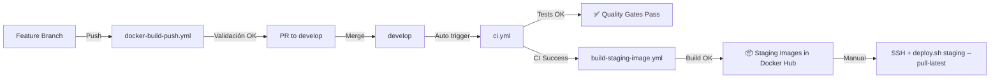
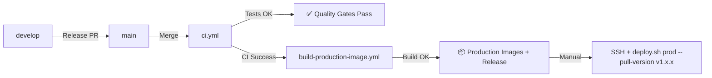

# GitHub Actions Workflows - Referencia Completa

**Fecha**: 2026-02-12
**Total Workflows**: 7

---

## 📊 Tabla de Workflows

| Workflow | Trigger | Propósito | Tareas Principales | Salidas |
|----------|---------|-----------|-------------------|---------|
| **ci.yml** | • Push a `develop`, `main`<br>• Pull request a `develop`, `main`<br>• Manual (`workflow_dispatch`) | Pipeline principal de CI/CD con calidad, tests, build y placeholders de deployment | 1. **changes**: Detectar archivos modificados (backend/frontend/docs)<br>2. **backend-quality**: Black, Ruff, Mypy<br>3. **frontend-quality**: ESLint, Type check<br>4. **backend-tests**: Tests con coverage, PostgreSQL<br>5. **frontend-tests**: Unit tests con coverage<br>6. **e2e-tests**: Tests E2E (desactivado temporalmente)<br>7. **security-scan**: Trivy + Safety check<br>8. **build-and-validate**: Build frontend production<br>9. **deploy-staging**: Placeholder con instrucciones manuales<br>10. **deploy-production**: Placeholder con instrucciones manuales | • Reportes de coverage (Codecov)<br>• Test results publicados en PR<br>• SARIF security scan<br>• Build artifacts (frontend/dist)<br>• Instrucciones de deployment manual |
| **build-staging-image.yml** | • **Después** de que `ci.yml` complete exitosamente en `develop`<br>• Manual (`workflow_dispatch`) | Build y push automático de imágenes Docker para staging (solo si CI pasa) | 1. Checkout code<br>2. Setup Docker Buildx<br>3. Login to Docker Hub<br>4. Extract commit SHA<br>5. Build backend (`jfdelafuente/contravento-backend`)<br>6. Build frontend (`jfdelafuente/contravento-frontend`)<br>7. Push images con tags<br>8. Generate summary | • **Backend images**:<br>&nbsp;&nbsp;- `staging-latest`<br>&nbsp;&nbsp;- `staging-{SHA}`<br>• **Frontend images**:<br>&nbsp;&nbsp;- `staging-latest`<br>&nbsp;&nbsp;- `staging-{SHA}`<br>• GitHub Step Summary con instrucciones de deploy manual |
| **build-production-image.yml** | • **Después** de que `ci.yml` complete exitosamente en `main`<br>• Manual (`workflow_dispatch`) | Build y push automático de imágenes Docker para producción + Release automation (solo si CI pasa) | 1. Checkout code<br>2. Setup Docker Buildx<br>3. Login to Docker Hub<br>4. Extract version from `package.json`<br>5. Extract commit SHA<br>6. Build backend<br>7. Build frontend<br>8. Push images con tags<br>9. Create Git tag (`v1.x.x`)<br>10. Generate changelog<br>11. Create GitHub Release | • **Backend images**:<br>&nbsp;&nbsp;- `latest`<br>&nbsp;&nbsp;- `v1.x.x`<br>&nbsp;&nbsp;- `production-{SHA}`<br>• **Frontend images**:<br>&nbsp;&nbsp;- `latest`<br>&nbsp;&nbsp;- `v1.x.x`<br>&nbsp;&nbsp;- `production-{SHA}`<br>• Git tag `v1.x.x`<br>• GitHub Release con changelog<br>• GitHub Step Summary |
| **docker-build-push.yml** | • Push a `feature/**`, `bugfix/**`, `hotfix/**`<br>• Pull request a `develop`, `main`<br>• Manual (`workflow_dispatch`) | Validación de builds Docker en feature branches (NO push a Docker Hub en PRs) | 1. Checkout code<br>2. Setup Docker Buildx<br>3. Login to Docker Hub<br>4. Extract metadata (tags, labels)<br>5. Build backend image<br>6. Build frontend image<br>7. Smoke test backend (Python import)<br>8. Smoke test frontend (static files check)<br>9. Push images (solo si NO es PR)<br>10. Show image digests | • **Builds validados** (no push en PRs)<br>• **Push solo en feature branches** (no PRs):<br>&nbsp;&nbsp;- Backend: `{branch-name}`<br>&nbsp;&nbsp;- Frontend: `{branch-name}`<br>• Test results (smoke tests)<br>• Image digests |
| **backend-tests.yml** | • Push a `develop`, `main`<br>• Pull request a `develop`, `main` | Tests completos del backend con PostgreSQL y reporting | 1. Checkout code<br>2. Setup Python 3.12<br>3. Install Poetry<br>4. Install dependencies<br>5. Run pytest con coverage<br>6. Upload coverage a Codecov<br>7. Publish test results en PR | • Coverage report (XML + term)<br>• Test results (JUnit XML)<br>• Coverage badge (Codecov)<br>• PR annotations con test failures |
| **frontend-tests.yml** | • Push a `develop`, `main`<br>• Pull request a `develop`, `main` | Tests unitarios del frontend con coverage | 1. Checkout code<br>2. Setup Node.js 20<br>3. Install npm dependencies<br>4. Run unit tests con Vitest<br>5. Upload coverage a Codecov | • Coverage report (JSON)<br>• Test results (console)<br>• Coverage badge (Codecov) |
| **claude.yml** | • Manual (`workflow_dispatch`) solo | Workflow auxiliar para desarrollo con Claude Code (deprecated o experimental) | 1. Placeholder o setup para Claude Code integration | • N/A (workflow auxiliar) |

---

## 🔄 Flujo de Trabajo Completo

### Feature Development → Staging



### Staging → Production



---

## 🔒 Dependencias entre Workflows (Quality Gates)

Para prevenir la construcción de imágenes Docker con código que falla tests, los workflows de build implementan **dependencias explícitas** usando `workflow_run`:

### ✅ Garantías de Calidad

**build-staging-image.yml**:
- ⏳ **Espera a**: `ci.yml` complete en rama `develop`
- ✅ **Solo se ejecuta si**: CI pasa todos los tests (conclusion == 'success')
- ❌ **No se ejecuta si**: CI falla (tests, linting, type check, security scan)
- 🔧 **Override manual**: Puede ejecutarse manualmente con `workflow_dispatch`

**build-production-image.yml**:
- ⏳ **Espera a**: `ci.yml` complete en rama `main`
- ✅ **Solo se ejecuta si**: CI pasa todos los tests (conclusion == 'success')
- ❌ **No se ejecuta si**: CI falla
- 🔧 **Override manual**: Puede ejecutarse manualmente con `workflow_dispatch`

### 📊 Flujo Secuencial

```
Push to develop/main
    ↓
CI/CD Pipeline (ci.yml) ejecuta
    ├── Backend Quality (Black, Ruff, Mypy)
    ├── Frontend Quality (ESLint, Type Check)
    ├── Backend Tests (pytest + coverage)
    ├── Frontend Tests (Vitest + coverage)
    ├── Security Scan (Trivy + Safety)
    └── Build & Validate
    ↓
Si CI pasa ✅ → Trigger build-staging/production-image.yml
Si CI falla ❌ → NO se construyen imágenes Docker
```

**Beneficios**:
- 🛡️ Nunca se suben imágenes Docker con tests fallidos
- 💰 Ahorra recursos (no builds innecesarios si CI falla)
- 🔍 Logs más claros (solo un workflow falla, no dos)
- ⚡ Deploy manual siempre posible con `workflow_dispatch`

---

## 🎯 Workflows por Propósito

### Calidad y Testing (CI)
- **ci.yml**: Pipeline principal con calidad, tests y build
- **backend-tests.yml**: Tests backend específicos
- **frontend-tests.yml**: Tests frontend específicos

### Build y Deploy (CD)
- **build-staging-image.yml**: Build automático para staging
- **build-production-image.yml**: Build automático para producción + releases
- **docker-build-push.yml**: Validación de feature branches

### Auxiliares
- **claude.yml**: Desarrollo con Claude Code

---

## 📋 Triggers por Rama

| Rama | Workflows que se ejecutan |
|------|---------------------------|
| `feature/**` | docker-build-push.yml (build + test) |
| `bugfix/**` | docker-build-push.yml (build + test) |
| `hotfix/**` | docker-build-push.yml (build + test) |
| `develop` | ci.yml + build-staging-image.yml |
| `main` | ci.yml + build-production-image.yml |
| Pull Requests | ci.yml + docker-build-push.yml (sin push a Docker Hub) |

---

## 🔐 Secrets Requeridos

### Docker Hub (build-staging-image.yml, build-production-image.yml, docker-build-push.yml)
- `DOCKERHUB_USERNAME`: Username de Docker Hub (`jfdelafuente`)
- `DOCKERHUB_TOKEN`: Access token de Docker Hub

### Backend (ci.yml, backend-tests.yml)
- `SECRET_KEY`: Secret key para JWT (auto-generado en tests)

### Frontend (build-staging-image.yml, build-production-image.yml)
- `VITE_API_URL`: URL del backend API
- `VITE_TURNSTILE_SITE_KEY`: Cloudflare Turnstile site key

### Codecov (optional)
- `CODECOV_TOKEN`: Token para upload de coverage (opcional con public repos)

---

## ⚙️ Configuración de Environments

### Staging
- **URL**: https://staging.contravento.com
- **Protection rules**: Ninguna (deployment manual)
- **Secrets**: Heredados de repo

### Production
- **URL**: https://contravento.com
- **Protection rules**: Ninguna (deployment manual, confirmación en deploy.sh)
- **Secrets**: Heredados de repo

---

## 🚨 Resolución de Conflictos

### Problema: Workflows duplicados

**Antes** (conflicto):
- `develop` → Trigger: ci.yml + build-staging-image.yml + docker-build-push.yml ❌

**Después** (resuelto):
- `develop` → Trigger: ci.yml + build-staging-image.yml ✅
- `feature/**` → Trigger: docker-build-push.yml ✅

**Solución aplicada**: docker-build-push.yml solo se ejecuta en feature branches, NO en develop/main.

---

## 📖 Documentación Relacionada

- **Setup Docker Hub**: [DOCKER_HUB_SETUP_GUIDE.md](DOCKER_HUB_SETUP_GUIDE.md)
- **Branching Strategy**: [BRANCHING_STRATEGY_CICD.md](BRANCHING_STRATEGY_CICD.md)
- **Semi-Auto Deployment**: [SEMI_AUTO_DEPLOYMENT_SUMMARY.md](SEMI_AUTO_DEPLOYMENT_SUMMARY.md)
- **Quick Reference**: [BRANCHING_QUICK_REFERENCE.md](BRANCHING_QUICK_REFERENCE.md)

---

## 🔍 Debugging Workflows

### Ver runs en GitHub
```bash
# Ir a GitHub Actions tab
https://github.com/jfdelafuente/contravento-application-python/actions
```

### Ver logs de workflow específico
```bash
gh run list --workflow=ci.yml
gh run view <run-id> --log
```

### Re-run workflow fallido
```bash
gh run rerun <run-id>
```

### Trigger manual workflow
```bash
# build-staging-image.yml
gh workflow run build-staging-image.yml --ref develop

# build-production-image.yml
gh workflow run build-production-image.yml --ref main
```

---

**Última actualización**: 2026-02-12
**Próxima revisión**: Después de primer deployment exitoso en producción
